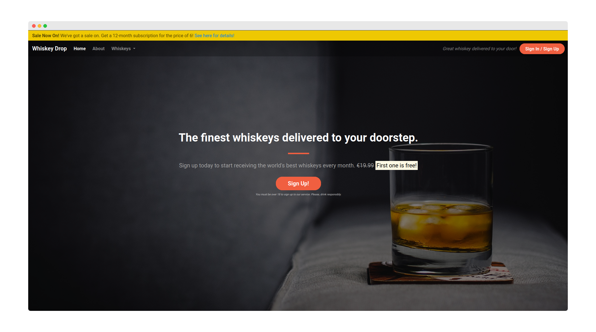
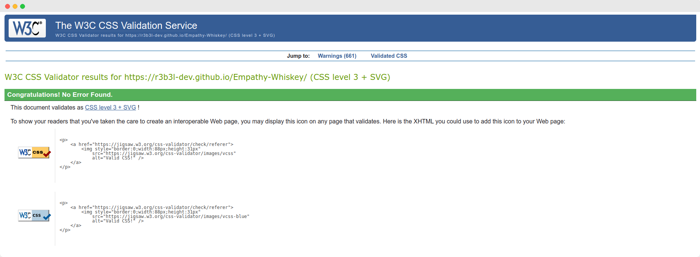
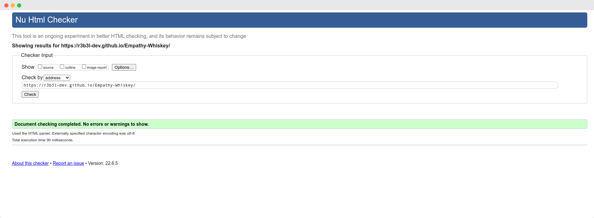
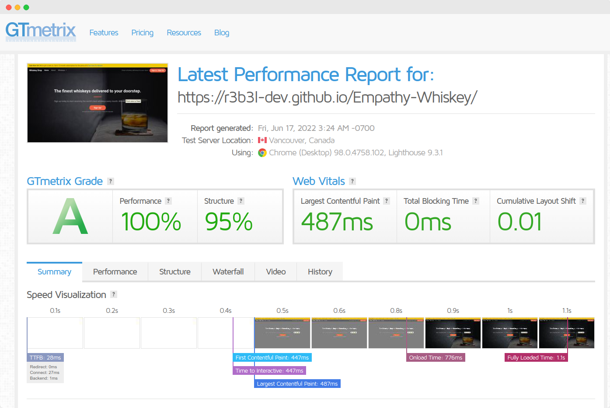

<div id="top"></div>

<!-- PROJECT LOGO -->
<br />
<div align="center">
<a href="https://github.com/r3b3l-dev/repo_name">
	
</a>

<p align="center">
	Built with HTML and CSS, whiskeydrop is a simple landing page for a whiskey delivery company.
	<br />
	<a href="https://r3b3l-dev.github.io/Empathy-Whiskey/">View Live Project Here</a>
</p>
</div>

<h2 align="center"></h2>

<br>
<!-- TABLE OF CONTENTS -->
<details>
<summary>Table of Contents</summary>
<ol>
	<li><a href="#user-experience-(ux)">User Experience (UX)<a></li>
	<li><a href="#features">Features</a></li>
	<li><a href="#technologies-used">Technologies Used</a></li>
	<li><a href="#testing">Testing</a></li>
	<li><a href="#deployment">Deployment</a></li>
	<li><a href="#credits">Credits</a></li>
</ol>
</details>
<br>


## User Experience (UX)

-   ### User stories

    -   #### First Time Visitor Goals

        1. As a First Time Visitor, I want to easily understand the main purpose of the site and learn more about the organisation.
        2. As a First Time Visitor, I want to be able to easily navigate throughout the site to find content.
        3. As a First Time Visitor, I want to locate their social media links to see their followings on social media to determine how trusted and known they are.

<p align="right">(<a href="#top">back to top</a>)</p>


## Features

-   Responsive on all device sizes

<p align="right">(<a href="#top">back to top</a>)</p>


## Technologies Used

### Languages Used

-   [HTML5](https://en.wikipedia.org/wiki/HTML5)
-   [CSS3](https://en.wikipedia.org/wiki/Cascading_Style_Sheets)

### Frameworks, Libraries & Programs Used

1. [BootStrap:](https://getbootstrap.com/)
	- Bootstrap was used to assist with the responsiveness and styling of the website.
1. [Git:](https://git-scm.com/)
	- Git was used for version control by utilizing the Gitpod terminal to commit to Git and Push to GitHub.
1. [GitHub:](https://github.com/)
	- GitHub is used to store the projects code after being pushed from Git.
1. [Font Awesome:](https://fontawesome.com/)
	- Font Awesome is the Internet's icon library and toolkit, used by millions of designers, developers, and content creators.

<p align="right">(<a href="#top">back to top</a>)</p>


## Testing

The W3C Markup Validator and W3C CSS Validator Services were used to validate every page of the project to ensure there were no syntax errors in the project.

[W3C CSS Validaton](https://validator.w3.org/)



[W3C HTML Validation](assets/img/validator.w3.png)




### Further Testing

[Lighthouse](https://developers.google.com/web/tools/lighthouse/) analyzes web apps and web pages, collecting modern performance metrics and insights on developer best practices.


[GTmetrix](https://gtmetrix.com/) was developed by Carbon60 as a tool for customers to easily test the performance of their webpages.


<p align="right">(<a href="#top">back to top</a>)</p>

## Deployment

### GitHub Pages

The project was deployed to GitHub Pages using the following steps...

1. Log in to GitHub and locate the [GitHub Repository](https://github.com/)
2. At the top of the Repository (not top of page), locate the "Settings" Button on the menu.
	- Alternatively Click [Here](https://raw.githubusercontent.com/) for a GIF demonstrating the process starting from Step 2.
3. Scroll down the Settings page until you locate the "GitHub Pages" Section.
4. Under "Source", click the dropdown called "None" and select "Master Branch".
5. The page will automatically refresh.
6. Scroll back down through the page to locate the now published site [link](https://github.com) in the "GitHub Pages" section.

### Forking the GitHub Repository

By forking the GitHub Repository we make a copy of the original repository on our GitHub account to view and/or make changes without affecting the original repository by using the following steps...

1. Log in to GitHub and locate the [GitHub Repository](https://github.com/)
2. At the top of the Repository (not top of page) just above the "Settings" Button on the menu, locate the "Fork" Button.
3. You should now have a copy of the original repository in your GitHub account.

### Making a Local Clone

1. Log in to GitHub and locate the [GitHub Repository](https://github.com/)
2. Under the repository name, click "Clone or download".
3. To clone the repository using HTTPS, under "Clone with HTTPS", copy the link.
4. Open Git Bash
5. Change the current working directory to the location where you want the cloned directory to be made.
6. Type `git clone`, and then paste the URL you copied in Step 3.

```
$ git clone https://github.com/YOUR-USERNAME/YOUR-REPOSITORY
```

7. Press Enter. Your local clone will be created.

```
$ git clone https://github.com/YOUR-USERNAME/YOUR-REPOSITORY
> Cloning into `CI-Clone`...
> remote: Counting objects: 10, done.
> remote: Compressing objects: 100% (8/8), done.
> remove: Total 10 (delta 1), reused 10 (delta 1)
> Unpacking objects: 100% (10/10), done.
```

Click [Here](https://help.github.com/en/github/creating-cloning-and-archiving-repositories/cloning-a-repository#cloning-a-repository-to-github-desktop) to retrieve pictures for some of the buttons and more detailed explanations of the above process.

<p align="right">(<a href="#top">back to top</a>)</p>

## Credits

### Conent & Code

-   All content and code is from a Code institute Tutorial [Code Institute](https://www.codeinstitute.net)


